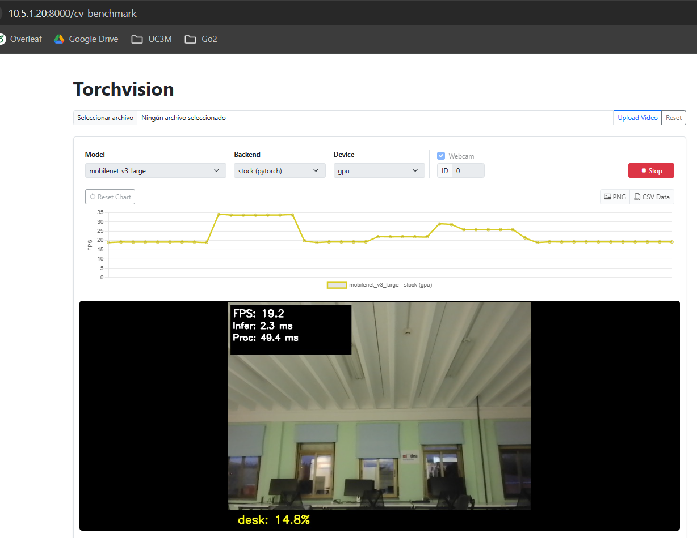

# SOL-vAccel integration and evaluation in 5TONIC - Publication

## Build docker images
Build the container image according to the target device:

```bash
sudo docker build -f dockerfile-torchvision-cpu . -t torchvision-app:cpu
sudo docker build -f dockerfile-torchvision-gpu . -t torchvision-app:gpu
```

## Download models

Models are provided as `models.tar.gz`, which extracts into a `models/` directory.

1. Download `models.tar.gz` from the link below.
2. Copy `models.tar.gz` into `src/`.
3. Replace `src/models/` with the extracted directory:
   ```bash
   cd src
   rm -rf models
   tar -xzf models.tar.gz
   ```
   
- [Download link](https://drive.google.com/file/d/1z1Av5hBn2I1S4mdNuMO88p3VpbLRTtrR/view?usp=sharing)

## Run benchmark test

### 1. Start the container

Start the container in CPU or GPU mode:

```bash
./run.sh cpu
# or
./run.sh gpu
```

### 2. Run benchmark script

Execute `benchmark_test.py` with the following environment variables.

- **DEVICE**: execution device  
  - `cpu` or `gpu`
  - If using `cpu` on ASUS G815 laptop, set `OMP_NUM_THREADS=10`

- **MODEL**: neural network model to benchmark  
  - **Segmentation**:  
    `deeplabv3_resnet50`, `deeplabv3_resnet50_sol`,  
    `fcn_resnet50`, `fcn_resnet50_sol`
  - **Image classification**:  
    `resnet50`, `resnet50_sol`,  
    `mobilenet_v3_large`, `mobilenet_v3_large_sol`
  - **Video classification**:  
    `mc3_18`, `mc3_18_sol`,  
    `r3d_18`, `r3d_18_sol` 

- **BACKEND**: inference backend  
  - `stock` or `vaccel` (not implemented)

- **NUM_IMAGES**: number of images to benchmark  
  - Uses the first *N* images (sorted) from `data/images`  
  - Default: `64`

- **NUM_VIDEOS**: number of videos to benchmark (video classification models only)  
  - Uses the first *N* videos (sorted) from `data/videos`  
  - Default: `10`

- **EXPORT_RESULTS**: save benchmark results  
  - Outputs `latency_results.csv` and `latency_results_summary.json`  
  - `true` or `false` (default: `false`)

- **EXPORT_OUTPUT_IMAGES**: save output images  
  - Requires `EXPORT_RESULTS=true`  
  - `true` or `false` (default: `false`)

Examples:

```shell
# Semantic segmentation (GPU)
DEVICE=gpu MODEL=deeplabv3_resnet50 NUM_IMAGES=64 python3 benchmark_test.py
DEVICE=gpu MODEL=fcn_resnet50 NUM_IMAGES=64 python3 benchmark_test.py

# Image classification (GPU)
DEVICE=gpu MODEL=resnet50 NUM_IMAGES=64 python3 benchmark_test.py
DEVICE=gpu MODEL=resnet50_sol NUM_IMAGES=64 python3 benchmark_test.py
DEVICE=gpu MODEL=mobilenet_v3_large NUM_IMAGES=64 python3 benchmark_test.py
DEVICE=gpu MODEL=mobilenet_v3_large_sol NUM_IMAGES=64 python3 benchmark_test.py

# Video classification (GPU)
DEVICE=gpu MODEL=mc3_18 NUM_VIDEOS=10 python3 benchmark_test.py
DEVICE=gpu MODEL=r3d_18 NUM_VIDEOS=10 python3 benchmark_test.py

# Image classification (CPU)
DEVICE=cpu MODEL=resnet50 NUM_IMAGES=64 OMP_NUM_THREADS=10 python3 benchmark_test.py
```

> Note: Results and images are not saved by default to avoid unnecessary disk usage. Set `EXPORT_RESULTS=true` to save benchmark metrics, and also set `EXPORT_OUTPUT_IMAGES=true` to store output images in the [results](./results) directory.

---

## Run the web application

### 1. Start the container

Start the container in CPU or GPU mode:

```bash
./run.sh cpu
# or
./run.sh gpu
```

### 2. Run web server

```shell
python3 serve.py
```

Once the server is running, open your browser and navigate to:

[http://10.5.1.20:8000](http://10.5.1.20:8000)



---

### Model I/O quick reference

Use this as a reminder of what each `MODEL` expects as input and what it produces:

- **Segmentation (2D)** — `deeplabv3_resnet50`, `fcn_resnet50`  
  **Input:** image → `(1, 3, 224, 224)`  
  **Output:** `(224, 224)` per-pixel class prediction map (one class ID per pixel)

- **Image classification** — `resnet50`, `mobilenet_v3_large`  
  **Input:** image → `(1, 3, 224, 224)`  
  **Output:** `top_class`, `top_prob` — predicted ImageNet-1k class ID and its confidence score

- **Video classification** — `mc3_18`, `r3d_18`  
  **Input:** video clip (16 frames) → `(1, 3, 16, 112, 112)`  
  **Output:** `top_class`, `top_prob` — predicted Kinetics-400 action class ID and its confidence score

---

## Required fix for `sol_mobilenet_v3_large` (SOL rc4 + cuDNN Graph)

The GPU deployment of **`sol_mobilenet_v3_large`** included in this repository
(`libsol-dnn-cudnn-deployment-0.8.0rc4-9.1.so`) is built against **cuDNN Graph 9.1.x**.

If the environment installs **PyTorch nightly / cu128**, it pulls **cuDNN 9.10.x** by default.
This causes `sol_mobilenet_v3_large.py` to fail at runtime with:

`CUDNN_STATUS_BAD_PARAM` (from `api_v9_graph.cpp`)

To run `sol_mobilenet_v3_large` correctly, **cuDNN must be downgraded to 9.1.1.17**:

```shell
# On torchvision-app:gpu container
python3 -m pip install --no-cache-dir --force-reinstall \
  "nvidia-cudnn-cu12==9.1.1.17" --no-deps
```
