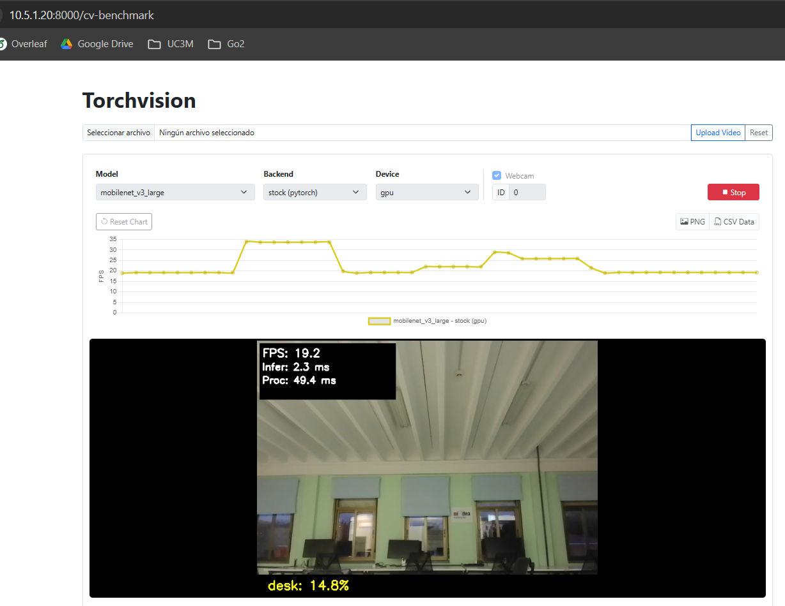

# SOL-vAccel integration and evaluation in 5TONIC - Publication

## Build docker images
Build the container image according to the target device:

```bash
sudo docker build -f dockerfile-torchvision-cpu . -t torchvision-app:cpu
sudo docker build -f dockerfile-torchvision-gpu . -t torchvision-app:gpu

# vAccel agent on the GPU host
sudo docker build -f dockerfile-torchvision-gpu-agent . -t torchvision-app:agent
```

## Download models

Models are provided as `models.tar.gz`, which extracts into a `models/` directory.

1. Download `models.tar.gz` from the link below.
2. Copy `models.tar.gz` into `src/`.
3. Replace `src/models/` with the extracted directory:
   ```bash
   cd src
   rm -rf models
   tar -xzf models.tar.gz
   ```
   
- [Download link](https://drive.google.com/file/d/1pte0m_6HKMS40C-olHXxqNc0_EAQssZU/view?usp=sharing)
- [Download link (rc4)](https://drive.google.com/file/d/1z1Av5hBn2I1S4mdNuMO88p3VpbLRTtrR/view?usp=sharing)

### Generate vAccel wrappers

To generate vAccel wrappers for the supported models from a directory of stock
SOL models, launch the gpu container:

```bash
./run.sh gpu
```

and run the provided script:

```bash
python3 /scripts/sol_vaccel_wrappers/gen_sol_vaccel_wrappers.py models
```

## Run model benchmark

### 1. Start the container

Start the container in CPU or GPU mode:

```bash
./run.sh cpu
# or
./run.sh gpu
```

#### vAccel remote setup

To use the vAccel remote backend, first start the agent container on the remote
GPU host:

```bash
./run_agent.sh 9125
```

where `9125` is the port to use. If the port is omitted, `9125` will be used by
default.

Consequently, specify the remote agent's address on the (local) host when
starting the main container:

```bash
./run.sh cpu 10.5.1.20:9125
# or
./run.sh gpu 10.5.1.20:9125
```

### 2. Run model benchmark script

Execute `model_benchmark.py` with the following environment variables.

- **DEVICE**: execution device  
  - `cpu` or `gpu`
  - If using `cpu` on ASUS G815 laptop, set `OMP_NUM_THREADS=10`

- **HOST**: execution host identifier  
  - `edge` or `robot`
  - Default: `edge`

- **MODEL**: neural network model to benchmark  
  - **Segmentation**:  
    `deeplabv3_resnet50`, `deeplabv3_resnet50_sol`,  
    `fcn_resnet50`, `fcn_resnet50_sol`
  - **Image classification**:  
    `resnet50`, `resnet50_sol`,  
    `mobilenet_v3_large`, `mobilenet_v3_large_sol`
  - **Video classification**:  
    `mc3_18`, `mc3_18_sol`,  
    `r3d_18`, `r3d_18_sol` 

- **BACKEND**: inference backend  
  - `stock` (default), `vaccel-local` (or `vaccel`) or `vaccel-remote`

- **SOL_RUN_MODE**: SOL execution mode *(SOL models only)*  
  - `2` → **Option 2 (default)**: explicit buffers per call  
    - Uses `run(*args)` (explicit input/output buffers each iteration)  
    - By default, no `set_IO` is required  
    - *(GPU only)* may still apply `set_IO(...)` + `optimize(2)` for supported models to improve performance  
  - `3` → **Option 3**: bound buffers + optimized run  
    - Calls `set_IO(...)` once  
    - Uses `run()` (no args) + `get_output()` / `sync()`  
    - Enables GPU optimizations (`optimize(2)` on GPU)  
  - Default: `2`

- **NUM_IMAGES**: number of images to benchmark  
  - Uses the first *N* images (sorted) from `data/images`  
  - Default: `64`

- **NUM_VIDEOS**: number of videos to benchmark (video classification models only)  
  - Uses the first *N* videos (sorted) from `data/videos`  
  - Default: `10`

- **EXPORT_RESULTS**: save benchmark results  
  - Outputs `benchmark_data.csv` and `benchmark_summary.json`  
  - `true` or `false` (default: `false`)

- **RUN_TAG**: Experiment run prefix identifier *(optional)*  
  - Used to tag the output directory under  
    `/results/experiments/model-stats/`  
  - The final directory name is always auto-generated as:  
    `<RUN_TAG>_<model>_<backend>_<host>_<device>
  - If not set, the current `<timestamp>` is used as the prefix.

- **EXPORT_OUTPUT_IMAGES**: save output images  
  - Requires `EXPORT_RESULTS=true`  
  - `true` or `false` (default: `false`)

Examples:

```shell
# Stock image classification (CPU)
DEVICE=gpu MODEL=resnet50 NUM_IMAGES=64 OMP_NUM_THREADS=10 python3 model_benchmark.py
# Stock image classification (GPU)
DEVICE=gpu MODEL=resnet50 NUM_IMAGES=64 python3 model_benchmark.py
# vAccel local image classification (CPU)
DEVICE=cpu BACKEND=vaccel-local MODEL=resnet50_sol NUM_IMAGES=64 OMP_NUM_THREADS=10 python3 model_benchmark.py
# vAccel local image classification (GPU)
DEVICE=gpu BACKEND=vaccel-local MODEL=resnet50_sol NUM_IMAGES=64 python3 model_benchmark.py
# vAccel remote image classification (CPU)
DEVICE=cpu BACKEND=vaccel-remote MODEL=resnet50_sol NUM_IMAGES=64 python3 model_benchmark.py
# vAccel remote image classification (GPU)
DEVICE=gpu BACKEND=vaccel-remote MODEL=resnet50_sol NUM_IMAGES=64 python3 model_benchmark.py
```

> Note: Results and images are not saved by default to avoid unnecessary disk usage. Set `EXPORT_RESULTS=true` to save benchmark metrics, and also set `EXPORT_OUTPUT_IMAGES=true` to store output images in the [results/experiments/model-stats](./results/experiments/model-stats/) directory.

---

## Run model benchmark with resource consumption

### 1. Start the monitoring service

See [README_MONITORING.md](./README_MONITORING.md)

Start the `docker-stats-collector` and `system-stats-collector` containers:

```bash
./run_monitoring.sh edge
# or
./run_monitoring.sh robot
```

### 2. Start the container

Start the container in CPU or GPU mode:

```bash
./run.sh cpu
# or
./run.sh gpu
```

### 2. Run benchmark script

Execute `model_benchmark_resources.py` with the following environment variables.

Examples:
```shell
NUM_IMAGES=32 BACKEND=stock HOST=robot DEVICE=cpu MODEL=resnet50_sol RUN_TAG=run1 DOCKER_STATS_ENDPOINT=http://192.168.2.2:6000 SYSTEM_STATS_ENDPOINT=http://192.168.2.2:6001 python3 model_benchmark_resources.py

NUM_IMAGES=32 BACKEND=vaccel-remote HOST=robot DEVICE=gpu MODEL=resnet50_sol RUN_TAG=run1 DOCKER_STATS_ENDPOINT=http://192.168.2.2:6000 SYSTEM_STATS_ENDPOINT=http://192.168.2.2:6001 DOCKER_STATS_REMOTE_ENDPOINT=http://10.5.1.20:6000 SYSTEM_STATS_REMOTE_ENDPOINT=http://10.5.1.20:6001 python3 model_benchmark_resources.py
```

Auto:
```shell
./evaluate_models.sh --backend stock --host robot --device cpu --run-tag run1 --sleep 10
./evaluate_models.sh --backend vaccel-local --host robot --device cpu --run-tag run1 --sleep 10

./evaluate_models.sh --backend stock --host edge --device gpu --run-tag run1 --sleep 10
./evaluate_models.sh --backend vaccel-local --host edge --device gpu --run-tag run1 --sleep 10
```

---

## Run the web application

### 1. Start the container

Start the container in CPU or GPU mode:

```bash
./run.sh cpu
# or
./run.sh gpu
```

### 2. Run web server

```shell
python3 serve.py
```

Once the server is running, open your browser and navigate to:

[http://10.5.1.20:8000](http://10.5.1.20:8000)



---

### Model I/O quick reference

Quick reminder of **input/output shapes and their sizes** (based on [model_adapter.py](./src/model_adapter.py), assuming **float32 = 4 B**, **uint8 = 1 B**).

#### Segmentation (2D) — `deeplabv3_resnet50`, `fcn_resnet50`

* **Input to model**
  Shape: `(1, 3, 224, 224)` (float32)
  **Size:** **≈ 588 KiB**

* **Raw model output (logits)**
  Shape: `(1, 21, 224, 224)` (float32)
  **Size:** **≈ 4.02 MiB**

* **SOL extra buffer (aux output, segmentation only)**
  Shape: `(1, 21, 224, 224)` (float32)
  **Size:** **≈ 4.02 MiB**

* **Postprocessed output (returned by app)**
  Shape: `(224, 224)` class IDs (uint8)
  **Size:** **≈ 49 KiB**

---

#### Image classification — `resnet50`, `mobilenet_v3_large`, `swin_t`

* **Input to model**
  Shape: `(1, 3, 224, 224)` (float32)
  **Size:** **≈ 602 KB**

* **Raw model output (logits)**
  Shape: `(1, 1000)` (float32)
  **Size:** **≈ 4 KB**

* **Postprocessed output (returned by app)**
  `top_class` (int64) + `top_prob` (float32)
  **Size:** **≈ 12 B (negligible)**

---

#### Video classification — `mc3_18`, `r3d_18`

* **Input to model**
  Shape: `(1, 3, 16, 112, 112)` (float32)
  **Size:** **≈ 2.40 MB**

* **Raw model output (logits)**
  Shape: `(1, 400)` (float32)
  **Size:** **≈ 1.6 KB**

* **Postprocessed output (returned by app)**
  `top_class` (int64) + `top_prob` (float32)
  **Size:** **≈ 12 B (negligible)**

---

#### ML payload bandwidth over TCP (UE ↔ Edge)

[ml_payload_over_tcp_bw.sh](./ml_payload_over_tcp_bw.sh) measures **TCP throughput** and **average transfer time per ML tensor payload** for the above inputs/outputs
  
It prints: total bytes, total time, throughput (MiB/s + Mbit/s), and avg time per payload (ms).

- Uplink (UE → Edge)

On **Edge**:
```bash
nc -lk -p 5001 > /dev/null
```

On **UE**:
```bash
EDGE_IP=10.5.1.20 PORT=5001 ./ml_payload_over_tcp_bw.sh uplink
```

- Downlink (Edge → UE)

On **UE**:
```bash
nc -lk -p 5001 > /dev/null
```

On **Edge**:
```bash
UE_IP=10.3.202.66 PORT=5001 ./ml_payload_over_tcp_bw.sh downlink
```

---

## Required fix for `sol_mobilenet_v3_large` (SOL rc4 + cuDNN Graph)

The GPU deployment of **`sol_mobilenet_v3_large`** included in this repository
(`libsol-dnn-cudnn-deployment-0.8.0rc4-9.1.so`) is built against **cuDNN Graph 9.1.x**.

If the environment installs **PyTorch nightly / cu128**, it pulls **cuDNN 9.10.x** by default.
This causes `sol_mobilenet_v3_large.py` to fail at runtime with:

`CUDNN_STATUS_BAD_PARAM` (from `api_v9_graph.cpp`)

To run `sol_mobilenet_v3_large` correctly, **cuDNN must be downgraded to 9.1.1.17**:

```shell
# On torchvision-app:gpu container
python3 -m pip install --no-cache-dir --force-reinstall \
  "nvidia-cudnn-cu12==9.1.1.17" --no-deps
```
